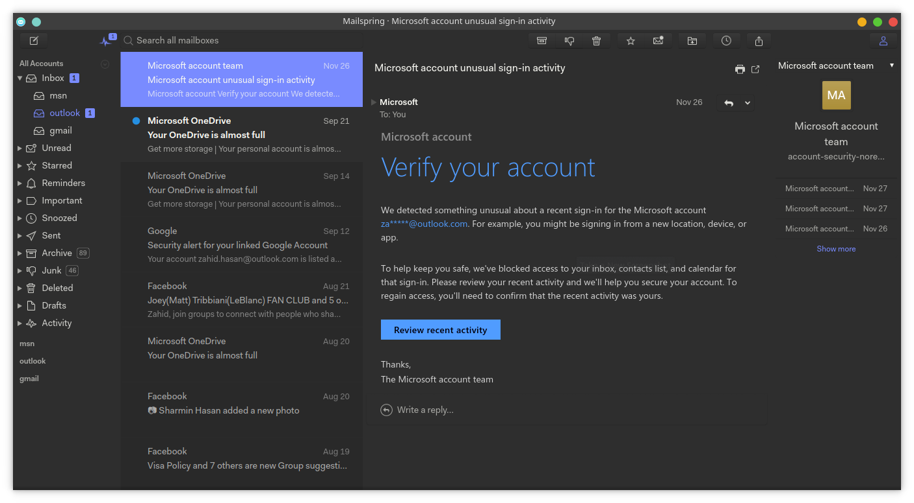

# A Minimalist Dark Light Theme for [MailSpring](https://getmailspring.com)

> A light dark theme for [MailSpring](https://getmailspring.com).



## Download

#### Using Git

If you are a git user, you can install the theme and keep up to date by cloning the repo:
```ps
$ git clone https://github.com/ZahidHasan/Dark-Light-Theme-Mailspring.git
```
#### Manually Download

Download zip file and unzip it into a folder.

## Install Theme

1. Open MailSpring
2. Go the the Edit menu
3. Select "Install Theme..."
4. And choose the folder you cloned/downloaded the repo to.
5. you are done!


## License

[MIT License](./LICENSE)
